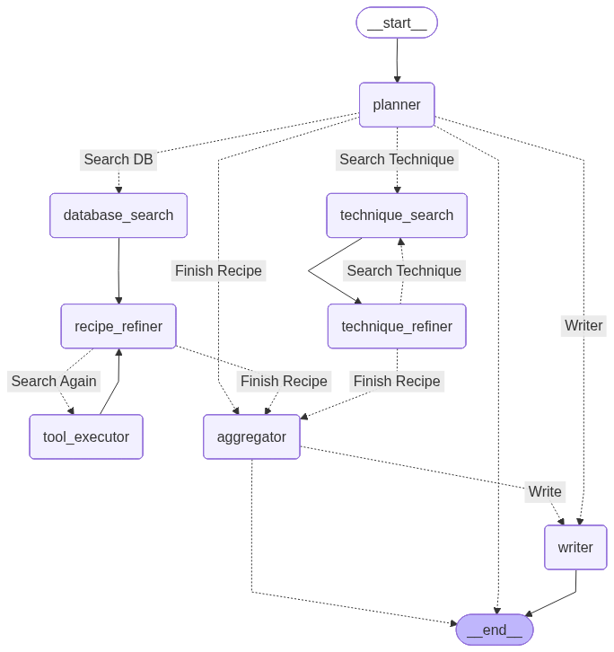

# Cooking Agent V1.3


An intelligent culinary assistant powered by LangGraph and DuckDuckGo Search.

Unlike standard chatbots that hallucinate recipes, this agent performs recipe retrieval real-time web scraping to find authentic recipes and cooking techniques. It is built with MCP architecture for easy interoperability


This is just the beginning of my personal project where I will learn how to build AI Agents and experiment with LLMs. Currently, the agent is limited in tool use, I will add more as I get more ideas.


For this third iteration, I implemented the agentic logic in LangGraph and added a Vector Database of cookbooks I found online.

In the next iteration, I will deploy the agent to cloud alognside proper session management for multiple users.

## Agent Workflow




The **CookingAgent** orchestrates a **LangGraph** workflow to execute fan-out research streams before synthesizing a final response.

1.  **Planning Phase**: The `planner` node decomposes requests into parallel `Recipe` (ingredients) and/or `Technique` (science) queries.
2.  **Recipe Track**: Prioritizes local data via `database_search`. The `recipe_refiner` only triggers online searches via `tool_executor` if strictly necessary.
3.  **Technique Track**: Concurrently runs `technique_search` to gather "how-to" principles, looping through `technique_refiner` for depth.
4.  **Synthesis**: Once the `aggregator` confirms completion, the `writer` node (persona: "Pocket Gordon Ramsay") compiles the research into a master-class guide.
## Features


**Agentic Workflow**: Main Agent that takes decisions based on gathered data.

**Real-Time Web Scraping**: Fetches live data using DuckDuckGo and Trafilatura (no stale data).

**Vector Database**: Chroma DB

**Chunking**: Documents are chunked either based on headers or pages, according to their structure (cooking books have some structure that can be taken advantage of)

**Smart Filtering**: Automatically strips ads, blog fluff, and SEO narratives from recipe sites.

**Technique Research**: Can research "food science" questions (e.g., Why is my steak tough?) separately from recipe ingredients.

**Grounded Generation**: Forces the LLM to use scraped data for generation to reduce hallucinations.

## Tech Stack

LLM: llama-3.1 70B-Versatile and Qwen3-32B

**Search** DuckDuckGo Search (duckduckgo_search)

**Vector Database**: ChromaDB

**Scraping**: Trafilatura & Requests

**Environment**: Python 3.13

**Markdown** Rendering: Rich

▶️ Usage

1. First run the server:

```
python server.py
```

2. In a separate terminal, run the main agent loop:

```
python main.py
```

Now all that is left is to get cooking!
Eet Smakelijk!

