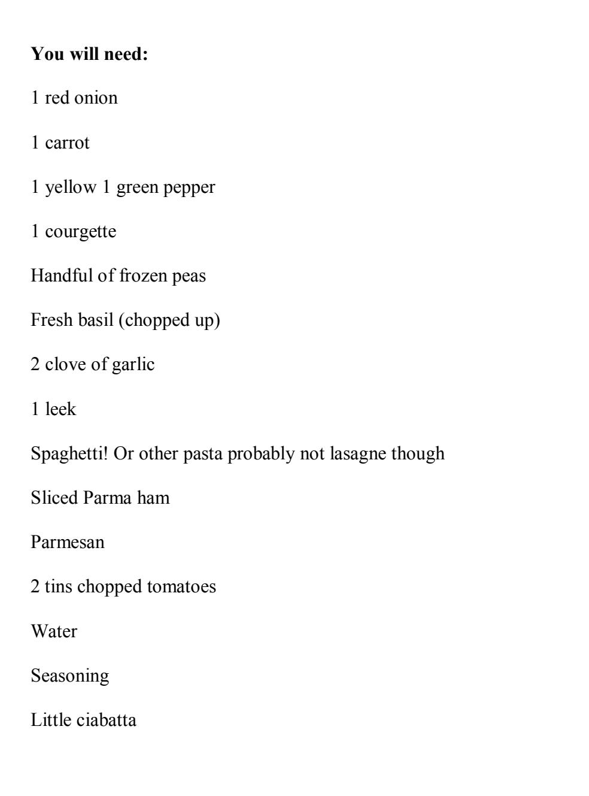

## The Real Chef:

### A Guide To Cooking and General Kitchen Banter

Anthony Dalton

© Copyright Anthony Dalton 2013

This is a legally distributed free edition from www.obooko.com The author's intellectual property rights are protected by international Copyright law. You are licensed to use this digital copy strictly for your personal enjoyment only: it must not be redistributed or offered for sale in any form.

#### **Introduction (rant 1)**

I don't think I'm alone in the world of catering when I say; I don't like celebrity chefs. With the current craze for proper cooking and making top drawer food more accessible to everybody, celebrity chefs have become mock idols in the eyes of many, making a tidy profit in book sales and restaurant punters in the process. One down side from the point of view of those employed in the catering trade is that *everybody* is a chef now. A few TV cookery shows makes the world and his wife experts on all things culinary and apparently gives them the right to pass judgement on those who cook for a living. My many rants about know it all customers and celebrity chefs have been condensed into this book, oh and I'll also be giving you a few industry tested recipes along the way.

#### **(Rant 2)**

Eating out is a luxury that few of us can afford with much regularity in recent times and when we do go out to eat chances are it will be at a local bistro type deal or a gastro pub if we want something a bit sexy for tea, (notice I haven't included any eateries owned by celebrity chefs here...). It's all very well making exceptionally nice meals (one at a time) with no consideration for ingredient cost (another difference between TV and real world cooking). Cooking at home and in the majority of restaurant kitchens usually involves much tighter purse strings than TV producers need to think about. Now consider that a chef in a place that the majority of us would have making our food has to make a gross profit of 65% and upwards on meals he or she serves, do they order or buy any ingredients they feel like? No they don't. They have to buy the cheapest ingredients they can and produce meals of a high enough standard to keep Mr and Mrs-Expert-Michelin-star-wannabe happy to part with their measly wages. Not an easy task by anybody's standard. Michelin star.... buzzword of the last 5 years..... Everybody has heard of them, people expect chefs to have at least one; nobody knows what is involved in obtaining one! I have worked with chefs who tirelessly knock out hundreds of amazing quality dishes day in day out and will do until they retire without a gram of recognition or even decent pay. The country's restaurants are full of unsung heroes like this who put up with all the irritating and moronic orders and smart arsery that gets thrown at them and still come in to work and make beautiful food.

#### **(Rant 3)**

I wanted to show you a few recipes that are used by angry sweaty drunk and abusive culinary artistes every day all over Britain. The reason these people are so stressed isn't easy to explain but I'll have a bash;

Imagine making a lovely fry up; bacon, sausage, mushroom, tomato, fried bread, black pudding, beans, fried eggs....

Now instead of just one fry up, its 20......

But hang on, 1 no bacon extra mushroom

1 no beans or egg extra fried bread,

4 no sausage toast not fried bread,

3 with poached egg not fried egg

Bacon extra crispy

No tomatoes

Beans separate.....

No they can't just leave the bits they don't want..........

#### AAAHHHHHHHH!!!!

Now imagine doing this with a myriad of pain-in-the-arse variations for 12 hours a day, 6 or 7 days a week.....

You'd probably be stressed too!

There are of course ways of alleviating the stress that happens in kitchens, here is a quick list;

Swearing helps. Language in kitchens is pretty ropey, females and males are equally as bad.

Ciggies! Most chefs smoke at some point in their career, it's tough to get a break otherwise.

Beer. I've never met a teetotal chef.

Brothers(or sisters) in arms. A good team of cooks as crazy as you on your side can make the madness seem not so terrible, even fun!

PREP! The right stuff in the right place is essential for moderating blood pressure

Chef slang! A few examples of this can be found in the glossary.

(Last bit before recipes happening in your place)

Ok one tip regarding the recipes that chefs use. They don't usually use them! Amounts like "some" and "enough" and "a good bosh" are commonplace and when recipes are used, metric and imperial measurements are found side by side in perfect harmony.

#### **Starters**

Unlike on TV there isn't one person doing each individual dish. The person doing your grilled asparagus appetiser will be responsible for ALL of the starters, salads, sandwiches as well as plating up desserts AND helping with the pots AND general fetching for the more senior chefs. Also consider they are likely to have no formal qualifications and are probably aged 16-18. A lot of chefs start out this way, usually by helping out when they are pot washing, attracted by the glamour of the kitchen!

So here are some dishes I've come across, come up with and used during my time doing commis bitchwork

#### **Minestrone Soup with Parma Crouton.**



#### **This is how we do it:**

Dice all the vegetables and arrange into 2 piles. Pile one contains everything apart from the courgette, peas and basil. Pile two is made up of the basil, courgette and peas.......

Saucepan, tablespoon of veg oil, get hot, not too hot.... put pile one into pan. Fry on medium heat until onions go soft then put the toms in there but don't chuck the tins. Fill each tin with water and put the water in the pan too. Chuck in a blob of tomato puree in and give it a furtle. Bring the soup to a gentle boil then turn down so it's just trying to boil. Throw in pile two

and the pasta; if its spaghetti or tag or whatever, cut/break it up into pieces that would fit on a soup spoon.

Cook until pasta is cooked, season up and Roberts your father's brother. This soup can be frozen.

For the crouton;

Slice of ciabatta, lightly bake/toast, put slice of Parma ham on, put parmesan shaving on top, toast again. Bosh.

#### **Grilled Asparagus With Goat's Cheese**

|  |  | You will need: |
|--|--|----------------|
|--|--|----------------|

Asparagus spears (4-5 per person)

Goat's cheese log (or some of....)

Black pepper

Balsamic reduction (optional)

#### **This is how we do it:**

Pan of water on and bring to a rolling boil. Cut the woody ends of the asparagus spears off and chuck the asparagus in the boiling water. Sing "Happy Birthday" at a reasonable pace then remove asparagus from the water and refresh in cold water to stop them cooking. Slice goat's cheese about 1.5cm thick. Put asparagus on a baking tray, goat's cheese on top. Whack in the preheated to 190 degrees oven until cheese is browning nicely. Serve with sprinkling of cracked black pepper and balsamic reduction if you fancy.

#### **Thai Beef With Noodles**

| You will need:                                         |  |  |
|--------------------------------------------------------|--|--|
|                                                        |  |  |
| Beef rump steak (100g ish per person, cut into strips) |  |  |
| Sweet chilli sauce                                     |  |  |
| Olive oil                                              |  |  |
| White wine vinegar                                     |  |  |
| 1 lime                                                 |  |  |
| Soy sauce                                              |  |  |
| Coriander (chopped up.)                                |  |  |
|                                                        |  |  |

Noodles (any will be fine but i prefer skinny to fat...)

#### **This is how we do it:**

Spring onions

Spinach

Put strips of beef in a tub with squirt of chilli sauce, squirt of olive oil, squirt of vinegar, squirt of soy sauce, juice of lime. Leave to marinate (ideally overnight)

If your noodles need cooking, do that first and refresh them in cold water, leave in the water until needed.

Hot pan. When the pan starts to smoke put the beef in and spread it about evenly. Move the beef about a bit and when it's looking like its getting there then throw in the spring onions and fry for a minute or 2, squirt some chilli and soy sauce in but not loads. Drain noodles and throw in. Mix up and throw in spinach and coriander last, stir in and serve.

## **You will need:** King prawns (tiger prawns, tiger shrimp, large prawns.... not scampi!) Butter (clarified or melted) Garlic Basil (chopped up) Rocket

**King Prawns In Garlic and Basil Butter**

#### **This is how we do it:**

Ciabatta

Hot pan squirt of veg oil, put in prawns about 5 per person. Turn the prawns over after about 3 minutes, after 2 minutes turn the heat down. Put teaspoon of garlic and 3 tablespoons of clarified butter. 3 minutes on the low light move prawns about to get the garlic on them. Throw in basil, stir and serve with fresh rocket and toasted ciabatta.

#### **Smoked Trout Mousse With Avocado Salad**

### **You will need:**

Smoked trout 1 fillet

Juice of half a lemon

Double cream 2 tablespoons

Seasoning

Half a ripe avocado

Mixed salad leaves

Extra Virgin olive oil

#### **This is how we do it:**

Check there are no bones in the trout then put the trout in a food processor and blitz it up with lemon juice and add the cream whilst it's blitzing. Don't over blitz it! Just enough so it's all smooth and nice. Put in a little dish or pot in the fridge overnight and serve the next day with seasonal salad leaves dressed with olive oil and black pepper and the ripe avocado. A bit of granary bread might be nice too.

| You will need:                                                                                             |
|------------------------------------------------------------------------------------------------------------|
|                                                                                                            |
| Fresh mussels (2 handfuls per person) available from most fishmongers during months that<br>contain an "R" |
| 2 cloves of garlic chopped up fine                                                                         |
| Tablespoon white onion finely diced                                                                        |
| White wine                                                                                                 |
| Cream                                                                                                      |
| French baguette                                                                                            |

**Moules Mariniere** (mussels in white wine and garlic sauce)

### **This is how we do it:**

Hot pan, put mussels in with onion, garlic and a good splash of white wine. Cover with lid and cook until all mussels have opened (very important!) drain off the liquid and put another little splash of wine plus half a pint of cream, bring to the boil then simmer for 2 minutes. Serve with crusty bread and fresh lemon.

#### **Chicken Liver Parfait With Red Onion Marmalade And Hot Toast**

# **You will need:** Good handful of chicken livers (with no green or funky bits attached!) 1 stick of butter (melted)

1 egg

Seasoning

Splash of brandy

3 red onions

2 tablespoons sugar

Sliced white bread!

### **This is how we do it:**

Blitz up chicken livers in food processor, add egg, pinch of salt and brandy then blitz. While it's blitzing slowly add the melted butter until all mixed up. Pass the whole mixture through a sieve or chinois. Put in ramekin or oven proof dishes then put in a preheated oven at 150 degrees, in a water bath, covered with foil and cook until there is no "wobble" in the middle or a skewer comes out without raw gear on.

For the chutney put sugar in a pan and melt until it just starts to go brown. Add sliced onion and cook until all the onion is fully cooked and most of the liquid is evaporated, serve cold.

For the toast, put sliced bread in toaster etc.

#### **Mains**

So.... Main Courses......

Like the starter chef, the main courses are often the domain of just one person. All the fish, meat, vegetarian, side orders, pasta etc. And the inherent variations and potential timing disasters are the responsibility of one usually quite red faced individual!

On busy shifts there will be possibly 2 chefs doing mains but not always. Although people rarely call in sick in the kitchen (brothers in arms...) restaurant owners would rather the wages of another staff was in their pocket!

Another thing to mention is that the majority of kitchens I have seen have been designed by idiots or bodged in a room that isn't suitable. Impractical layouts and tiny workspaces are the norm in smaller bistro kitchens especially. They are also quite often embarrassingly under equipped, many a kitchen lacks in many things including plastic tubs, big spoons, skillets, ramekins, main course plates, side plates, chip bowls and TOWELS! And there is never a friggin pen when you need one!!!!

Here are the recipes for my mains. Any bits that don't make sense there is a glossary in the back. Or Google it.

#### **Fillet Of Beef Wellington With Duxelle, Chips And Red Wine Jus**

## **You will need:** Fillet steak (any size, I would go for 7 oz) Puff pastry White onion Flat mushroom 1 garlic clove Jus (see basics section at the back) Nice chips (see basics)

### **This is how we do it:**

Seasoning

Roll out a piece of puff pastry that is the same width as your steak is high and that is a bit longer than the circumference of the steak. Seal the steak in a hot pan with a bit of oil in it, cooking it more if you like it more done. For example if you like your steak medium then cook it medium rare as it's going in the oven where it will be finished off. When it's fried up a treat take out of the pan and let it rest for a bit, while it's resting you could make the duxelle.

For the duxelle; rough dice ½ an onion and 1 large breakfast mushroom and put in the food processor with the garlic. Blitz up and season up.

Now get your steak, wrap the pastry around it sealing it together with a bit of water, top with the duxelle, pushing to the edges so its sealed the top of the steak, put it on a tray and whack it in the oven at about 180-190 degrees until the pastry is cooked. The steak needs to be sealed in its pastry/duxelle house to ensure even cooking.

Serve with the chips and little drizzle of jus and eat it all up in yer belly.

| Fish And Chips                  |  |  |
|---------------------------------|--|--|
| You will need:                  |  |  |
|                                 |  |  |
|                                 |  |  |
| 6-8 oz piece of cod or haddock  |  |  |
| Nice chips (see basics section) |  |  |
| Lemon                           |  |  |
| Self raising flour              |  |  |
| Beer                            |  |  |
| Seasoning                       |  |  |

### **This is how we do it:**

Make some batter; self raising flour, beer (preferably ale) pinch of salt, mix together with a whisk. The thicker the batter is raw, the heavier the batter will be cooked. If its fresh it will still be crispy though so if you are a fan of a few crispy bits while you're waiting at the chippy, make it a bit thicker.

Coat the piece of fish with flour and slap it in the batter. Deep fry in oil about 180 degrees until golden brown and completely floating on the top of the oil, turning over if necessary to get even crispiness.

Serve with your lovely chips and if you feel like it, a bit of lemon.

#### **Chicken and Mushroom Stroganoff**

### **You will need:**

1 chicken tit cut in strips

1 flat mushroom sliced

½ red onion diced

½ red pepper diced

1 clove garlic smooshed or chopped or whatever

2 teaspoons ground smoked paprika

Splash white wine

½ pint cream

Rice

### **This is how we do it:**

Fry chicken until cooked then whack mushrooms, onion and pepper in with the garlic as well. Fry up a bit more to get the veg going then pinch of salt and the paprika then stir it up to get the paprika on everything. Throw in the wine, then the cream, and then simmer until it looks like a lovely sauce and the veg is cooked. Serve with basmati rice or whatever rice is knocking around in the back of the cupboard.

#### **Fillets of Seabass Steamed with Lemon and Rosemary** with white wine sauce and green beans

| You will need:                           |  |  |
|------------------------------------------|--|--|
|                                          |  |  |
| 1 x 8-10 oz seabass- filleted and scaled |  |  |
| 1 lemon                                  |  |  |
| Rosemary                                 |  |  |
| White wine                               |  |  |
| White wine sauce (see the basics bit)    |  |  |
| Green beans                              |  |  |

### **This is how we do it:**

Olive oil

Top and tail the lemon and slice it lengthways in 3. Brown the slices of lemon in a pan with NO oil on both sides and pick 3 little sprigs of rosemary. Put the slices of caramelised lemon in a line along the flesh side of one of the fillets of seabass and put sprig of rosemary on each slice of lemon, then put the other fish fillet on the top skin side up. Get a bit of foil that will easily wrap the fish with plenty to spare and place the fishy lemony goodness in the middle. Fold up the edges and enclose the fish in what can only be described as a handbag type thing but leave a gap. Put in about a ¼ pint of wine and close up the handbag, trying to seal it up but leaving air in there too. Put in the oven at 180 degrees for about 15-20 minutes or until the fish feels firm when you prod it.

Cook the green beans the same as the asparagus from the starters but sing "Happy Birthday" twice through instead of once.

Serve the fish with white wine sauce and the beans and a sprinkle of black pepper.

#### **Steak And Ale Pie**

### **You will need:**

Diced chuck steak (good handful per person)

Mirapoid (see glossary)

1 clove of garlic chopped up

2 Sprigs each of rosemary, thyme, sage and mint all chopped up

Ale or stout the more people you need it for, the more beer you'll need...

Cornflour or arrowroot

Beef stock (see glossary)

Seasoning

Short crust pastry

Egg

### **This is how we do it:**

Fry beef in a hot saucepan. Add mirapoid and fry gently until softened. Add garlic and herbs and stir up. Add beer and beef stock until an inch or so above the meat etc and bring to the boil then turn heat right down and cover. Simmer for about 90 minutes or until the meat is tender- this will differ depending on the quality of your beef however if is taking longer don't worry and be patient!

When the meat is tender but not falling apart, season and thicken up using cornflour or arrowroot or bisto if you're a savage. Put into individual or one big pie dish, cover with a pastry lid painted with whisked up egg and pop in the oven at about 170-180 degrees until the pastry is nice and golden. Eat.

#### **Pork Medallions With Wholegrain Mustard Sauce And Bramley Mash.**

# **You will need:**

Pork medallions..... 2-3 per person

Wholegrain mustard

Cream

1 Cooking apple

¼ white onion

Mash

### **This is how we do it:**

Make the mash....

Peel and core the apple and cook with a tad of water and a pinch of sugar until mush. Mix into the mash.

Season the pork and fry in oil on both sides then pop in the oven to finish if necessary, don't overcook them.

Gently fry the onion then add 1 teaspoon of mustard and ½ pint of cream bring to the boil then simmer for a bit till it looks and tastes nice seasoning if required. I would also add any juices that are available from the pork to the sauce for extra flavours.

Put the mash, pork and sauce together and have a lovely time.

#### **Lamb Cutlets With Dauphinoise Potatoes, Roast Cherry Tomatoes And Mint Jus.**

| You will need:              |
|-----------------------------|
|                             |
|                             |
| Lamb cutlets 3-4 per person |
| Maris piper potato          |
| Cream                       |
| Garlic                      |
| Cherry tomatoes on the vine |
| Fresh mint                  |
| Jus (see basics)            |

### **This is how we do it:**

Peel and slice the potato, chop the garlic and whack it all in a pan with the cream; enough to just cover the potatoes, and some salt and pepper. Bring to the boil then put into a high sided baking tray or lasagne dish. Spread the potato about so the slices are all flat and put in a preheated oven at 150 degrees. Bake until a knife goes in and out indicating the potatoes are cooked.

When you put the potatoes in the oven, put the cherry tomatoes on a tray, drizzle with olive oil and sprinkle on a bit of seasoning and then whack them in as well.

While the potatoes cook get the lamb chops going; rub a bit of salt and pepper into the lamb chops all over then fry in a hot pan on both sides turning and cooking for longer the more done you like it.

Stir chopped fresh mint into some jus and serve lamb on top of the potatoes with the jus drizzled on top and the tomatoes on top of that.

#### **Homemade Beef Burger** (makes 3 burgers)

### **You will need:**

Beef mince – lean, 500g

White onion – finely diced, 1 onion

Garlic – crushed, 2 cloves

Tomato ketchup

English mustard

Branston pickle

Seasoning

### **This is how we do it:**

Put mince in a bowl and break up, fry onion and garlic on a middle heat until soft then add to mince. Add 1 tsp of mustard, 1 tablespoon of ketchup and 1 tablespoon of pickle and a good pinch of salt. Mix together thoroughly with your hands, the heat from your hands will soften the fat in the mince and make it bind together. When the mixture can be rolled into balls and squished into burgers that don't fall apart then stop mixing. Roll into 3 even sized balls and squash into burger shapes. Fry the burgers or grill them until the juices run clear and serve with chips, on a bap, on their own or however you like.

This recipe also makes good meatballs, just add a handful of grated parmesan and roll into little balls then fry or roast.

#### **Vegetarians**

All chefs hate vegetarians, fact. At least in my experience they do! The general consensus in kitchens is that vegetarian meals are shit and that meat is delish. My sister is a veggie though so I have done a couple of vegetarian recipes.

### **Roast Cherry Tomato And Mozzarella Risotto**

| You will need:              |
|-----------------------------|
|                             |
|                             |
| Cherry tomatoes on the vine |
| Fresh mozzarella ball       |
| White onion -1 finely diced |
| Arborio risotto rice        |
| Veg stock                   |
| White wine                  |

### **This is how we do it:**

Seasoning

Fry onion in veg oil until soft then put rice in and stir into onions slowly allowing the rice to fry a little bit. Put in about ¼ pint of white wine then add the veg stock and cook as per instructions on the back of the rice bag.....

While the rice is cooking, put the cherry tomatoes vine and all on a tray, drizzle with olive oil, season up and put in the oven at about 180 degrees until the skin of the tomatoes pop. Then pull the tomatoes off the vine, removing all stalks.

Chop the mozzarella ball into bits.

When the rice is just about ready but not quite, throw the tomatoes and mozzarella in and stir it up gently. Leave on a low heat for a couple of minutes to let the rice just finish off, serve.

#### **Provencale Vegetable Tagliatelle**

### **You will need:**

1 red, 1green, 1 yellow pepper 1 courgette 1 red onion 1 aubergine 2 cloves garlic 2 tomatoes

Fresh basil

Seasoning

Fresh tagliatelle

Extra Virgin olive oil

### **This is how we do it:**

Dice aubergine using only the outside (not the seeded bit) do the same for the courgette. Dice the peppers and onion and chop the garlic. Put all this veg in an oven tray, drizzle with Extra Virgin olive oil, season and roast in the oven at 180 degrees until the edges of the peppers are going dark brown. You might need to move the veg around a bit to get it cooked evenly.

When the veg is nearly done, cook your fresh tagliatelle in a pan of boiling water which has a small squirt of olive oil in it. When it's ready drain it off in a colander and while its draining get a pan on getting warm. Slice the tomatoes in half then in quarters then slices in fact just chop them up however! When the pan is hot, put a bit of veg oil, the sliced tomatoes, the roasted veg and the pasta in and furtle it about good and proper. The juice that's come out the roasted veg and the moisture of the tomatoes should stop it from burning and keep it moist. Turn it right down and chop up the fresh basil. Serve topped with a drizzle of Extra Virgin olive oil, cracked black pepper and the fresh basil on top. You could put parmesan on top too if you like, I would!

#### **A Nice Greek Saladio**

### **You will need:**

Mixed salad leaves (not iceberg or cos or anything like that, you should know what leaves you like but if you don't I would use: Red chard, rocket, mizuna and curly endive)

Large black olives with stones

Cherry tomatoes

Red onion

Feta cheese

Extra Virgin Olive oil

Black pepper

I just throw everything into the bowl I'm going to serve it from in the order I've listed above basically! Slice the red onion nice and thin and chop the feta into little cubes. This is ideal as an addition to accompany pasta.

#### **9HJHWDEOH\$QG\*RDW¶V&KHHVH\*DWHDX**

## **You will need:** 1 red pepper 1 butter nut squash 1 courgette 1 red onion 1 aubergine

Goat's cheese (2 cm slice per each gateau)

### **This is how we do it:**

Get a metal ring like a pastry cutting ring but taller that is about as wide as the butter nut squash you are going to use.

Slice the vegetables into 1 cm thick slices however you see fit, they are going to make up layers of the gateau. Now lightly fry them on each side with a bit of oil and seasoning until they get a bit of colour and take them off the heat and allow to cool for a short while. Get your metal ring on a tray and layer up the veg in an alternating fashion, gently pressing down each time. When the stack is high enough place the goat's cheese slice on top and put in a preheated oven at 180 degrees until the goat's cheese is golden brown on top. Take out and put on a plate, carefully slide the ring over the top. I would enjoy this with a bit of tomato sauce and a bit of basil pesto.

#### **+DOORXPL.HEDEV**

### **You will need:**

Bamboo skewers

Halloumi cheese

1 red, 1 green, 1 yellow pepper

2 red onions

Cherry tomatoes

Extra Virgin Olive oil

### **This is how we do it:**

Put your bamboo skewers in cold water, this will stop them burning. Cut up the halloumi, peppers and red onion into roughly inch squares and spike them onto the skewers alternating cheese, pepper, onion, tomatoes. Put on an oven tray, drizzle with olive oil, sprinkle with black pepper and bake in the oven at 180 degrees until the halloumi starts to brown. Slap on a salad or with some rice or cous cous or whatever you fancy!

#### **'HVHUWV**

I love desserts. I love making them and I especially love eating them! But as for serving them? No thanks. What a massive pain in the arse. That's why the recently promoted pot wash does it! Then they get shouted at when they look shit, then they get whipped with a damp tea towel and life goes on.

These recipes are ones I've adapted from others, invented myself or outright stolen! Enjoy.

#### **White Chocolate Cheesecake**

### **You will need:**

Spring form cake tin 9 inch

Cling film

500g white chocolate

250g mascarpone

250g full fat cream cheese

250ml double cream

125g caster sugar

1 large packet digestives

1 stick butter

### **This is how we do it:**

Melt chocolate in a bowl over a pan of boiling water and set aside. Whip the cream and mix thoroughly into the mascarpone, cream cheese and sugar.

Put the digestives in a food processor and blitz up, melt the butter and add to the biscuit crumbs. Line the cake tin with a double layer of cling film, put the buttery biscuit gear in the bottom and flatten out even across the bottom, don't press too hard.

When the chocolate has cooled to room temperature but before it starts to set hard again whisk it into the creamy cheese stuff and put into cake tin. Pop in the fridge and leave overnight to set.

#### **Chocolate And Marshmallow Fondant Pudding**

### **You will need:**

100g dark cooking chocolate (high cocoa solids 85% ish)

100g caster sugar

100g butter

100g plain flour

1 egg

Marshmallows

Super Mario moulds (see glossary) greased and floured

### **This is how we do it:**

Melt chocolate and butter over water, mix in sugar and flour, and stir in egg until thoroughly mixed in. Fill floured super Mario moulds 2 thirds full with the mix, push marshmallow into the middle until the mix covers it. Cook in oven at 170 degrees for about 10 minutes.

When the top is cooked, take out of the oven and run knife around the inside of the mould then turn out onto a plate. Inside should be a gooey chocolate marshmallow delight.

#### **Orange And Coconut Panna Cotta**

### **You will need:**

1 tin (beans sized) of Coconut milk

250ml Double cream

2 oranges

White chocolate drops

25 grams Caster sugar

3 leaves of Bronze leaf gelatine

### This is how we do it:

Put the gelatine leaves in a tub of cold water to go soft. While the gelatine is soaking put the coconut milk, cream, sugar and the zest of the oranges into a pan and bring to the boil, stirring every so often to make sure the sugar is dissolved. When the mixture starts to boil, take it off the heat, add the now softened gelatine leaves and stir in until they melt. Allow the mixture to cool to room temperature, put 4-5 chocolate drops in the bottom of super Mario moulds then fill up with the cream mixture. Place them in the fridge to set overnight. To serve; put into a tub of hot water to loosen up then turn out onto plate. I would have this with raspberries or unsweetened raspberry coulis.

| Bakewell tart (That is better than the Bakewell from Bakewell)                                   |
|--------------------------------------------------------------------------------------------------|
| You will need:                                                                                   |
|                                                                                                  |
|                                                                                                  |
| Pastry case-blind baked (see basics)                                                             |
| Strawberry jam                                                                                   |
| Ground almonds 9oz                                                                               |
| Plain flour 1oz                                                                                  |
| 4 medium Eggs                                                                                    |
| Caster sugar 9oz                                                                                 |
| Butter 9oz                                                                                       |
|                                                                                                  |
|                                                                                                  |
| This is how we do it:                                                                            |
| Spread the jam onto the base of the pastry case. Mix all the other ingredients together until it |

becomes a smooth pale paste and put on top of jam. Bake at 160 degrees until a skewer

comes out clean, usually about 45 minutes.

## **You will need:** Pastry case-blind baked 5 lemons –zest and juice Caster sugar 11oz 8 eggs whole 6 egg yolks

**Lemon tart**

### **This is how we do it:**

10 fl.oz double cream

Mix sugar, lemon juice and zest together (in a liquidiser ideally). Add eggs a bit at a time then do the same with the cream. Put in a jug or similar and put in the fridge overnight and the next day a froth should be sitting on top, scoop this froth out and get rid. Pour the remaining mixture into the pastry case and bake at 160 degrees for approximately 25 minutes or until there is a slight wobble in the middle of the tart.

| You will need:        |
|-----------------------|
| 400g dark chocolate   |
| 100g caster sugar     |
| 1 stick salted butter |
| 4 eggs whole          |
| 2 egg yolks           |
|                       |

**Chocolate pot**

### **This is how we do it:**

1 tin Carnation Cream

Melt the chocolate, butter and sugar in a bowl over a pan of boiling water, add the eggs and mix thoroughly. Add the Carnation cream and mix in then keep over the water for 5-10 minutes. Pour into pots and set overnight in the fridge. These go particularly well with shortbread.

#### **Basics**

Here are a few basic recipes that most professional chefs take for granted and are staple in almost all commercial kitchens. Some of them can be adapted to suit by replacing flavours and non-essential ingredients. The way these basics are written are more of a rough guideline than step by step recipes, the beauty of cooking is the fuzzy lines and ability to experiment and get creative so why not have a try with a few of these.

**Mirapoid**: Start for most soups, casseroles and stocks. I use: White onion, celery, carrot, leek, garlic.

**Smooth Soup**: I will do leek and potato but you can use any vegetable instead and the result will be the same, a tasty soup. Mirapoid (minus the carrot as this will be a green soup) fried in butter until soft. Add potato and vegetable stock and cook until spuds are well cooked. Liquidise, season and serve.

**Meat stock**: roast some bones. Fry mirapoid until brown, add roasted bones and cover with water. Bring to the boil then simmer for a good long time. Throw in some nice herbs like thyme, rosemary, mint, sage, for extra flavours. For veg stock do the same but miss out the bones............

**Red wine jus**. Reduce red wine in a pan by 2/3 then add meat stock. Reduce until at a lovely consistency but not too thick!

**Salad dressing**: 1 tablespoon of mustard in a liquidiser with 1 tablespoon of honey, 1 tablespoon of lemon juice. Blitz up with ¼ pint white wine vinegar. While it is blitzing, slowly add ½ pint of vegetable oil. The mustard can be any, the vinegar can be any and the veg oil can be olive oil. Add herbs or cheese maybe? Take out the honey and use treacle? Endless possibilities (almost...).

**Bread**: 600g strong white flour, 12g salt, 15g butter, 370 ml warm water with 7g active dried yeast in it and 2 tsp of sugar. When the yeast has woken up, mix it with the other ingredients then knead it for ages....... use half white half granary for granary bread. The white dough can then be used as pizza base but for bread, cut in half, mould into a loaf shape, put on a tray somewhere warm until it is half again bigger. Bake at 170 degrees until cooked.

**Sweet pastry**: 18oz plain flour, 6oz icing sugar, ½ stick of butter, 2 large eggs. Mix everything but the eggs, then add eggs. If you roll a pastry case, leave it in the fridge overnight before baking it and it is less likely to crack.

**No Bake cheesecake**: equal parts full fat cream cheese, mascarpone and whipped cream with ½ quantity of caster sugar. 1 packet of digestives to 1 stick of butter for the base. Add fruit, melted chocolate, vanilla or whatever.

**Self raising flour**: 1lb of plain flour to 1oz of baking powder.

**Custard**: ½ pint double cream and ½ tsp vanilla essence in a pan. Bring to the boil. Pour onto 1 egg and 1 tblsp of sugar and whisk. Cook over a low light until starts to thicken. Don't try and reheat, it will go crap.

**Good chips**: use maris piper potatoes. Cut chips. Deep fry in oil that is at 125 degrees until a knife goes in and out easily indicating they are cooked. Allow to cool overnight in the fridge. Cook in oil at 185 degrees until golden brown and crispy.

#### **Glossary and helpful tips**

**Homosexual pastry** (puff pastry)

**Meez!** (as in Meez en place; preparation)

Over the years I've picked up many slang terms, silly names for food related things and daft tips that make life a bit easier. This final section lists a few of them.

```
Slang
Raw as a rats ring (not cooked quite enough) 
In the rin tin tin (in the bin) 
File it under B1N (as above) 
Super Mario moulds (dariole moulds) 
Big feller (large cooks knife) 
Tits (Breast of a chicken or duck) 
Cans (tits...) 
Growlers/dogs (sausages) 
Burglars (burgers) 
Pot (the person washing pots' name. All of them) 
Chicken period (egg) 
Saladio! (salad) 
"Soda Water" (lemonade in secret because the boss is too tight to let you drink lemonade) 
Bang it in the micky (put it in the microwave oven for a time) 
Quick flash (short amount of cooking time) 
Blitz it up (put it in the food processor) 
AFD (All Fucking Day-shift) 
Dry as a nun's chuff (lacking in moistness) 
Tight as a ducks arse (Not forthcoming with lemonade for staff) 
Natty bit of skank (not entirely unpleasant looking person)
```

**The pass** (where the checks come in and the food goes out)

**Chef's day off** (Usually Sunday. Also known as no hat day)

**Spanky Chix** (chicken breast that has been flattened out to shorten cooking time)

#### **Tips**

The best way to peel ginger is with the edge of a teaspoon

Bang the stalk of iceberg lettuce on the counter and the stalk will then just come out easily

A pinch of salt helps egg whites get stiffer, also use room temperature eggs

Any alcohol got from the bar for cooking is issued in this ratio: 1 for the food 1 for the chef

Open oysters with and oyster knife. Not a screwdriver or a meat cleaver.

Blunt knife? No steel? Bottom of a mug or lasagne dish.

10 second rule! If any food item gets dropped, there are 10 seconds until it can't be used.....

Don't ever give your lighter to a waitress. You won't get it back!

#### **Final thought**

This is the end of the little insight into my head. I hope it's been educational. I leave you with this parting comment which I imagine is a point of view shared by many a chef.

Despite what the waiter, menu or management says, any variation or straying from the dishes exactly as described on the menu is NOT ok and to make a request of this nature makes you a massive tool and the chef will probably drop your food on the floor or possibly in the bin..... Maybe.....

Please note: This is a free digital edition from www.obooko.com.

If you paid for this e-book it will be an illegal, pirated copy so please advise the author and obooko. We also recommend you return to the retailer to demand an immediate refund.